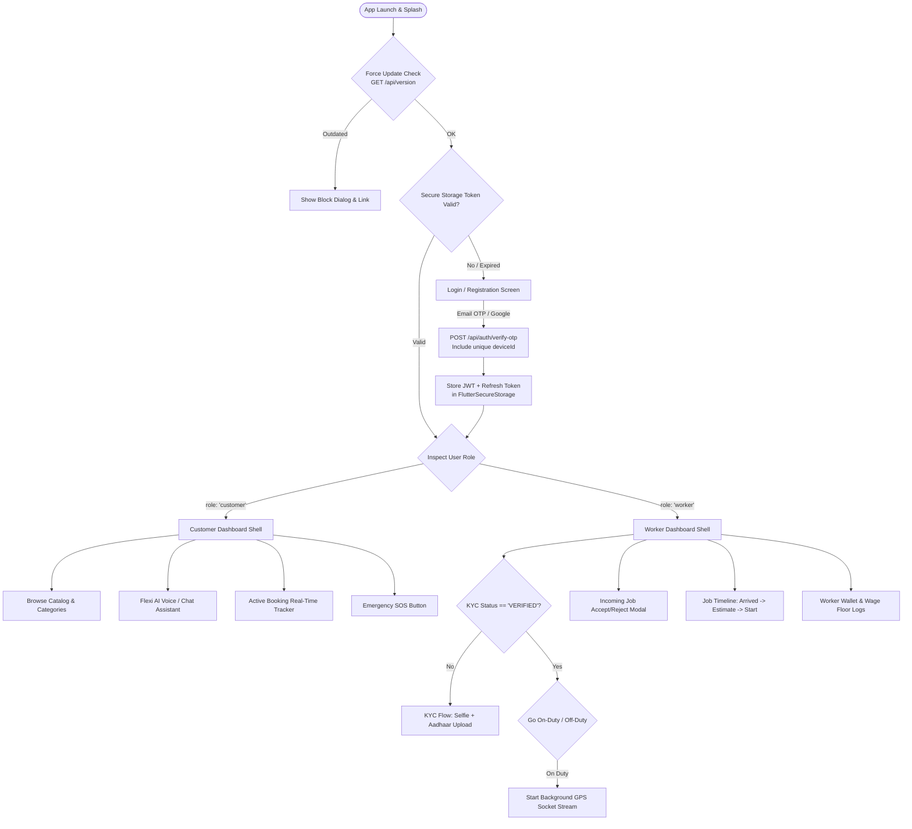
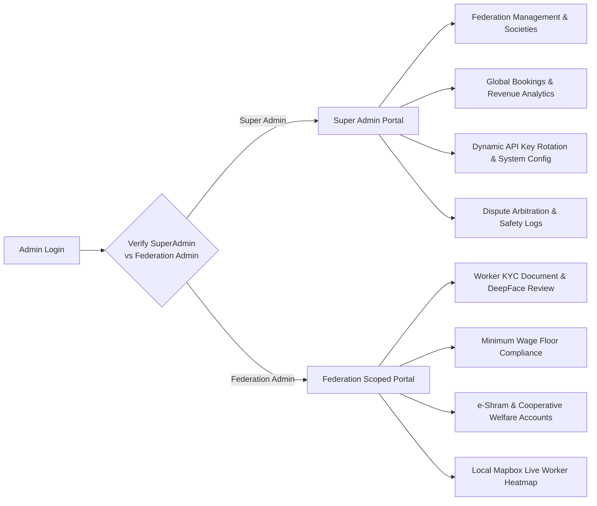
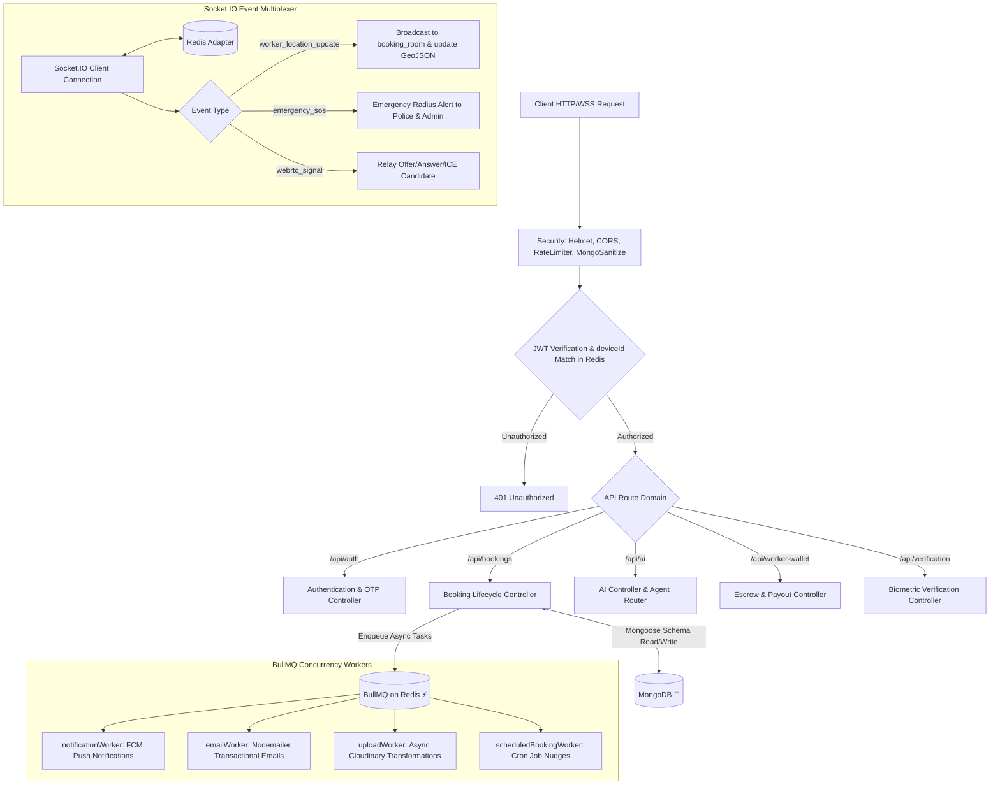
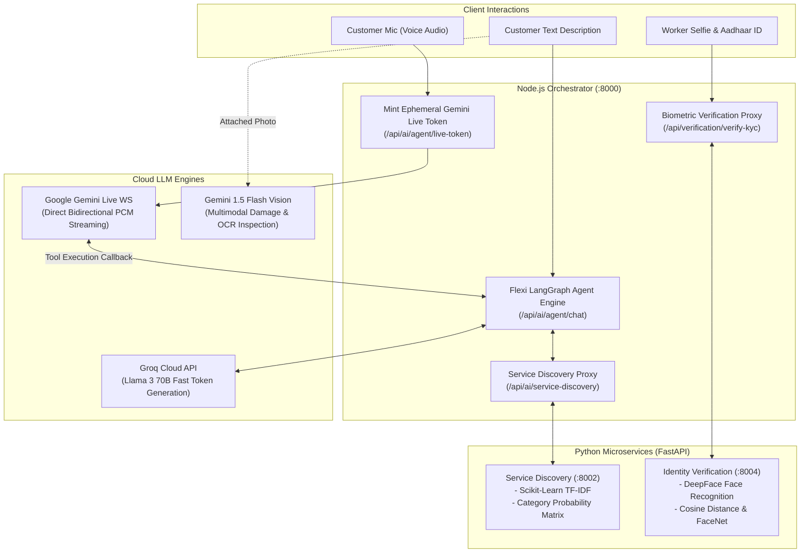
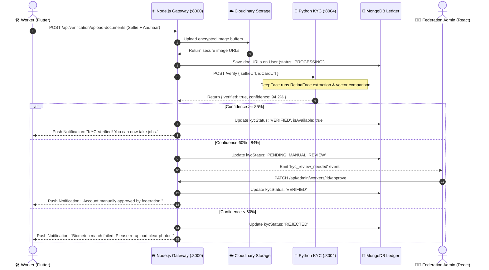
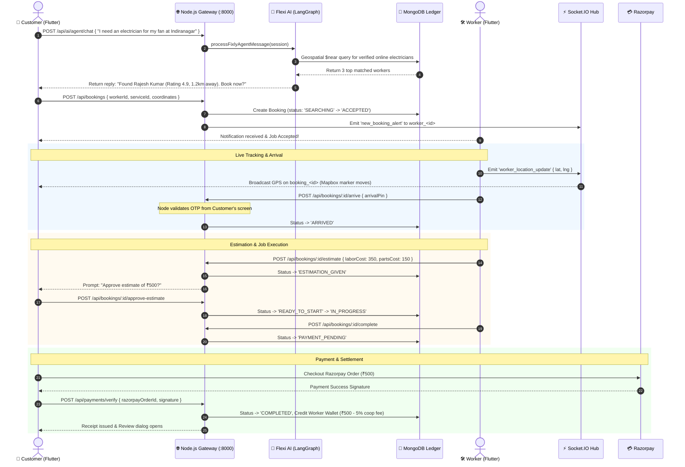

# Fixly — Comprehensive End-to-End System Architecture & App Flow

This document details the complete end-to-end architecture, interaction lifecycle, data pipelines, and technology stacks powering **Fixly** (Cooperative Gig Services Platform for Household & Community Services). It illustrates how the Flutter mobile application, React administration dashboard, Node.js API gateway, and Python AI/ML microservices interact in real time.

---

## Table of Contents
1. [Master Technology Stack Matrix](#1-master-technology-stack-matrix)
2. [Global System Architecture Diagram](#2-global-system-architecture-diagram)
3. [Frontend: Flutter Mobile Application (Customer & Worker)](#3-frontend-flutter-mobile-application-customer--worker)
4. [Frontend: React Admin & Cooperative Federation Panel](#4-frontend-react-admin--cooperative-federation-panel)
5. [Backend Core Engine (Node.js, MongoDB, Redis, BullMQ, Sockets)](#5-backend-core-engine-nodejs-mongodb-redis-bullmq-sockets)
6. [AI & Machine Learning Ecosystem](#6-ai--machine-learning-ecosystem)
7. [End-to-End Interconnected Lifecycles & Sequence Diagrams](#7-end-to-end-interconnected-lifecycles--sequence-diagrams)
   - [7.1 Worker Onboarding & DeepFace KYC Lifecycle](#71-worker-onboarding--deepface-kyc-lifecycle)
   - [7.2 AI-Assisted Booking, Geospatial Matching, & Job Execution](#72-ai-assisted-booking-geospatial-matching--job-execution)
   - [7.3 Real-Time WebRTC Audio Call & Emergency SOS Broadcast](#73-real-time-webrtc-audio-call--emergency-sos-broadcast)
8. [Data Models & Schema Architecture](#8-data-models--schema-architecture)

---

## 1. Master Technology Stack Matrix

| Domain / Layer | Technology / Framework | Role & Key Responsibilities |
| :--- | :--- | :--- |
| **Mobile Client** | **Flutter (Dart 3.7+)** | Single unified codebase for both **Customer** and **Worker** personas. Uses BLoC (`flutter_bloc`) for reactive state management, `go_router` for declarative routing, `mapbox_maps_flutter` for geospatial rendering, `socket_io_client` for real-time tracking, `flutter_webrtc` for encrypted VoIP calls, and `razorpay_flutter` for checkout. |
| **Admin Dashboard** | **React 18 + Vite 5 + Tailwind** | Multi-tenant governance portal for **Super Admins** and **Federation Admins**. Built with React Router, Leaflet/Mapbox maps, Recharts for cooperative telemetry, and Axios with JWT interceptors. Scoped queries by cooperative federation. |
| **API Gateway & Core** | **Node.js (ESM) + Express 5** | High-performance asynchronous REST and WebSocket gateway running on port `8000`. Handles authentication, booking state machine, payment verification, job estimation, and proxying AI requests. |
| **Primary Database** | **MongoDB + Mongoose** | Document store acting as the system of record. Uses `2dsphere` geospatial indexing for low-latency `$near` worker proximity discovery, ACID transactions for financial ledger operations, and schema validation. |
| **Cache, Sessions & Queues** | **Redis + BullMQ + ioredis** | Multi-device session store (`deviceId` tracking with refresh token rotation), ephemeral chat history TTL (~10 min), Socket.IO Redis adapter for cluster scaling, and distributed queue broker for background job processing. |
| **Background Workers** | **BullMQ Workers (Node.js)** | Offloads intensive I/O: `emailWorker` (OTP/transactional SMTP), `uploadWorker` (Cloudinary pipeline), `notificationWorker` (Firebase FCM fan-out), and `scheduledBookingWorker` (automated 24h/1h/30m reminder cron nudges). |
| **Real-Time Layer** | **Socket.IO + WebRTC** | Bidirectional event bus for live worker GPS broadcasting (`worker_location_update`), room-based booking status synchronization, panic button SOS radius alerts, and WebRTC STUN/TURN signaling. |
| **AI Concierge & Agents** | **LangGraph + LangChain** | Multi-agent autonomous assistant (**Flexi**) orchestrating conversational booking, service discovery, quote estimation, and worker dispatching with state persistence in Redis. |
| **Cloud LLMs & Voice** | **Gemini Live + Groq + Gemini Vision** | `gemini-3.1-flash-live-preview` for bidirectional real-time voice streaming; Groq (Llama 3) for fast text inference; Gemini 1.5 Flash Vision for certificate OCR and damage inspection. |
| **ML Microservice 1** | **Python (FastAPI :8002)** | **Service Discovery Service**: Natural language intent classification using Scikit-Learn TF-IDF vectorization and pickled classifiers to map free-form customer problem descriptions to platform service IDs. |
| **ML Microservice 2** | **Python (FastAPI :8004)** | **Identity Verification Service**: Automated biometric KYC using **DeepFace** (facenet/VGG-Face) comparing live worker selfies against government Aadhaar/PAN cards. |
| **Third-Party Integrations** | **Razorpay, Cloudinary, Firebase, SMTP** | Razorpay & RazorpayX for customer escrow & worker payouts; Cloudinary for media storage; Firebase Cloud Messaging (FCM) for push notifications; Nodemailer for transactional emails. |

---

## 2. Global System Architecture Diagram

```mermaid
flowchart TB
    subgraph CLIENT_TIER ["Client Surfaces"]
        direction LR
        CustomerApp["📱 Customer App\n(Flutter / BLoC)"]
        WorkerApp["🛠️ Worker App\n(Flutter / BLoC)"]
        AdminPanel["💻 Admin & Federation Panel\n(React 18 / Vite / Tailwind)"]
    end

    subgraph NETWORK_TIER ["API Gateway & Transport"]
        direction TB
        HTTPS["HTTPS REST API (JWT / deviceId)"]
        WSS["WebSocket / Socket.IO (Live GPS & Signaling)"]
        GeminiWSS["Direct WebSocket (Google Gemini Live Voice)"]
    end

    subgraph BACKEND_TIER ["Core Backend Platform (:8000)"]
        direction TB
        AuthService["Auth & Session Controller\n(Refresh Rotation / Device Guards)"]
        BookingEngine["Booking & Matching Engine\n(Geospatial $near / Lifecycle FSM)"]
        SocketEngine["Socket.IO & WebRTC Hub\n(Rooms, Signaling, SOS Broadcast)"]
        WageEngine["Fair Wage & Wallet Engine\n(Wage Floors, Escrow, Payouts)"]
        BullMQEngine["BullMQ Background Workers\n(Email, FCM Push, Reminders, Media)"]
        FlexiEngine["Flexi AI LangGraph Agent\n(Tools, Routing, Intent FSM)"]
    end

    subgraph DATA_TIER ["Persistence & Caching Layer"]
        direction LR
        MongoDB[("MongoDB 🍃\n(Users, Bookings, GeoJSON,\nFederations, Ledger)")]
        RedisDB[("Redis Cache ⚡\n(Sessions, BullMQ Queues,\nSocket Adapter, Chat TTL)")]
    end

    subgraph AI_ML_TIER ["AI / ML Processing Engines"]
        direction TB
        PythonDiscovery["FastAPI Discovery (:8002)\n(TF-IDF + Sklearn Classifier)"]
        PythonKYC["FastAPI Identity KYC (:8004)\n(DeepFace Biometric Matcher)"]
        CloudLLMs["Cloud LLMs\n(Groq Llama 3 / Gemini Vision OCR)"]
        GoogleGeminiLive["Google Gemini Live\n(Ephemeral Token Voice Stream)"]
    end

    subgraph EXTERNAL_TIER ["External Cloud Providers"]
        direction LR
        Razorpay["Razorpay / RazorpayX 💳\n(Escrow & Bank Payouts)"]
        FCM["Firebase FCM 🔔\n(Push Notifications)"]
        Cloudinary["Cloudinary ☁️\n(Encrypted Media Storage)"]
    end

    %% Client to Network
    CustomerApp -->|REST / JSON| HTTPS
    WorkerApp -->|REST / JSON| HTTPS
    AdminPanel -->|REST / JSON| HTTPS
    CustomerApp <-->|Socket.IO| WSS
    WorkerApp <-->|Socket.IO| WSS
    CustomerApp <-->|Audio PCM Stream| GeminiWSS

    %% Network to Backend
    HTTPS --> AuthService
    HTTPS --> BookingEngine
    HTTPS --> WageEngine
    HTTPS --> FlexiEngine
    WSS <--> SocketEngine
    GeminiWSS <--> GoogleGeminiLive

    %% Backend to Data
    AuthService <--> MongoDB
    AuthService <--> RedisDB
    BookingEngine <--> MongoDB
    WageEngine <--> MongoDB
    SocketEngine <--> RedisDB
    BullMQEngine <--> RedisDB
    FlexiEngine <--> RedisDB
    FlexiEngine <--> MongoDB

    %% Backend to AI/ML
    FlexiEngine <--> CloudLLMs
    FlexiEngine -->|Mint Live Token| GoogleGeminiLive
    BookingEngine -->|Classify Text| PythonDiscovery
    AuthService -->|Verify Selfie vs ID| PythonKYC

    %% Backend to External
    WageEngine <--> Razorpay
    BullMQEngine --> FCM
    BullMQEngine --> Cloudinary
```



---

## 3. Frontend: Flutter Mobile Application (Customer & Worker)

The Fixly mobile application is built using a **single-codebase, dual-persona pattern**. After authentication, the client inspects the JWT claims and user role, branching into either the **Customer Experience** or the **Worker Experience**.



### Key Technical Subsystems in Flutter:
1. **BLoC State Management:** Segregated state across business domains (`AuthBloc`, `BookingBloc`, `FlexiAgentBloc`, `LocationTrackingCubit`, `WebRTCCallCubit`, `WalletCubit`).
2. **Geospatial & Mapbox:** `MapboxMap` coordinates live pins. Worker movement interpolates smoothly between GPS lat/lng points using bearing calculations.
3. **WebSockets (`socket_io_client`):** Connects to Node.js backend using `token` handshake. Joins dedicated rooms: `booking_<id>` and `worker_<id>`.
4. **Gemini Live Service (`gemini_live_service.dart`):** Records 16kHz PCM audio via `record` package, streams chunked base64 packets over WebSocket directly to Google Generative Language API, receives incoming audio bytes, and plays them via `flutter_tts` / audio sink.

---

## 4. Frontend: React Admin & Cooperative Federation Panel

The Fixly Admin Panel (`FIXLY ADMIN PANEL`) is a responsive dashboard tailored for platform administrators and independent cooperative managers.



### Core Capabilities:
- **Tenant Data Isolation:** Federation admins only see workers, bookings, and financial analytics belonging to their registered cooperative society (`cooperativeId`). Super admins have complete visibility.
- **Dynamic Configuration Management:** API keys (Gemini, Groq, Cloudinary, Razorpay) can be updated through the UI and persisted to MongoDB `Settings`, allowing secret rotation without redeploying backend containers.
- **Biometric Audit Review:** Human-in-the-loop review for KYC edge cases where DeepFace confidence is borderline (between 60% and 80%).

---

## 5. Backend Core Engine (Node.js, MongoDB, Redis, BullMQ, Sockets)

The backend acts as the central orchestrator of business logic, security, and state persistence.



### The Booking State Machine:
Every job progresses through an immutable state machine enforced by backend controllers:

$$\text{PENDING} \longrightarrow \text{APPROVED/SEARCHING} \longrightarrow \text{ACCEPTED} \longrightarrow \text{ARRIVED} \longrightarrow \text{ESTIMATION\_GIVEN} \longrightarrow \text{READY\_TO\_START} \longrightarrow \text{IN\_PROGRESS} \longrightarrow \text{PAYMENT\_PENDING} \longrightarrow \text{COMPLETED}$$

- **Arrival Handshake:** Worker cannot start the job without an Arrival OTP generated on the customer's phone.
- **Two-Step Estimation:** Once arrived, the worker inspects the problem and inputs an estimate (Labor + Spare Parts). The customer approves the estimate digitally before the state transitions to `READY_TO_START`.

---

## 6. AI & Machine Learning Ecosystem

Fixly decouples heavy ML inference from the main Node.js event loop using specialized Python microservices and cloud LLM APIs.



### 1. Flexi AI Concierge (LangGraph Multi-Agent)
Flexi is implemented as a state graph (`backend/agent/graph/graph.js`) with distinct nodes:
- **`intentClassifierNode`**: Categorizes input into booking intent, catalog search, status inquiry, or generic conversation.
- **`serviceDiscoveryNode`**: Queries MongoDB `Service` models matching category tokens.
- **`workerMatchingNode`**: Runs geospatial `$near` queries to find nearby available workers with verified badges.
- **`bookingCreationNode`**: Generates a draft `Booking` record once parameters (service, time, location) are satisfied.

### 2. Python ML Microservices
- **Discovery Service (Port 8002):** Receives raw customer text (e.g., *"My kitchen pipe is bursting water"*), cleans and tokenizes strings, evaluates using TF-IDF vectorizers, and outputs the top predicted platform category (e.g., `Plumbing -> Pipe Repair`).
- **KYC Identity Verification (Port 8004):** Downloads image buffers for selfie and government ID, runs DeepFace face detection (RetinaFace), extracts 128-dimensional facial embedding vectors, computes Euclidean/Cosine distance, and returns a verified match score.

---

## 7. End-to-End Interconnected Lifecycles & Sequence Diagrams

### 7.1 Worker Onboarding & DeepFace KYC Lifecycle



---

### 7.2 AI-Assisted Booking, Geospatial Matching, & Job Execution



---

### 7.3 Real-Time WebRTC Audio Call & Emergency SOS Broadcast

```mermaid
sequenceDiagram
    autonumber
    actor Customer as 📱 Customer App
    participant Sockets as ⚡ Socket.IO Gateway
    actor Worker as 🛠️ Worker App
    participant Mongo as 🍃 MongoDB Ledger
    actor Admin as 👨‍💼 Federation Admin

    Note over Customer,Worker: WebRTC Encrypted VoIP Call
    Customer->>Sockets: Emit 'webrtc_call_user' { targetUserId: workerId, offerSDP }
    Sockets->>Worker: Relay incoming call alert (CallKit UI rings)
    Worker->>Sockets: Emit 'webrtc_answer_call' { answerSDP }
    Sockets->>Customer: Relay answerSDP
    Customer<-->Worker: Direct P2P Encrypted Audio Media Stream (SRTP)

    Note over Customer,Admin: Emergency SOS Panic Trigger
    Customer->>Sockets: Emit 'emergency_sos' { bookingId, lat, lng, reason: 'Harassment/Unsafe' }
    Sockets->>Mongo: Create EmergencyAlert record
    Sockets-->>Admin: High-priority acoustic siren & map pin in Admin Panel
    Sockets-->>Worker: Emit 'emergency_broadcast_radius'
    Sockets->>Sockets: Automated SMS / FCM alert sent to registered Emergency Contacts
```

---

## 8. Data Models & Schema Architecture

Fixly’s data integrity is maintained through Mongoose schemas structured to support multi-tenant cooperative scoping and real-time state synchronization:

```mermaid
erDiagram
    COOPERATIVE ||--o{ USER : "governs"
    USER ||--o{ BOOKING : "customer_places"
    USER ||--o{ BOOKING : "worker_accepts"
    USER ||--o{ WORKER_CERTIFICATE : "submits"
    USER ||--o{ WELFARE_ACCOUNT : "owns"
    BOOKING ||--o{ TRANSACTION : "settles"
    BOOKING ||--o{ REVIEW : "generates"
    BOOKING ||--|| SERVICE : "categorized_by"
    USER ||--o{ EMERGENCY_CONTACT : "configures"

    USER {
        ObjectId _id PK
        string name
        string email
        string phone
        string role "customer | worker | admin | federation_admin"
        ObjectId cooperativeId FK
        string kycStatus "UNVERIFIED | PROCESSING | VERIFIED | REJECTED"
        GeoJSON location "type: Point, coordinates: [lng, lat]"
        boolean isOnline
        number walletBalance
    }

    BOOKING {
        ObjectId _id PK
        ObjectId customerId FK
        ObjectId workerId FK
        ObjectId serviceId FK
        string status "PENDING | ACCEPTED | ARRIVED | IN_PROGRESS | COMPLETED"
        string arrivalPin
        object estimate "laborCost, partsCost, approvedAt"
        number totalAmount
        string paymentStatus "PENDING | ESCROWED | RELEASED"
        GeoJSON destinationLocation
    }

    SERVICE {
        ObjectId _id PK
        string title
        string category
        number basePrice
        number wageFloorMinimum
    }

    TRANSACTION {
        ObjectId _id PK
        ObjectId bookingId FK
        ObjectId userId FK
        number amount
        string type "PAYMENT | PAYOUT | WELFARE_DEDUCTION"
        string status "SUCCESS | FAILED | ESCROWED"
    }

    WELFARE_ACCOUNT {
        ObjectId _id PK
        ObjectId workerId FK
        string eShramNumber
        number insuranceCoverageAmount
        number accumulatedWelfareFund
    }
```



---

## Summary

The Fixly platform architecture guarantees:
1. **Zero Direct Exposure of AI/ML to Mobile Clients:** The Flutter mobile application only communicates with the Node.js API Gateway (with the single exception of Google Gemini Live audio PCM websockets using ephemeral tokens minted by Node.js).
2. **Cooperative Data Scoping:** Federation Admins operate within isolated boundaries, enforcing local minimum wage floors and worker welfare policies.
3. **Resilient Offline & Real-Time Sync:** Socket.IO and Redis adapters ensure real-time location and call telemetry, with BullMQ workers decoupling intensive notifications, emails, and media transformations.
4. **Verified Trust & Safety:** DeepFace automated face matching, certificate verification, arrival OTPs, and WebSockets SOS alerts create a secure ecosystem for both gig workers and consumers.
