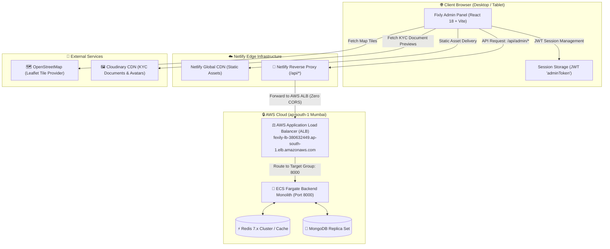
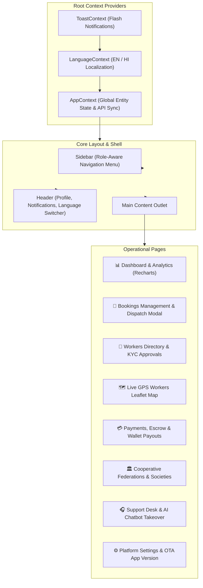
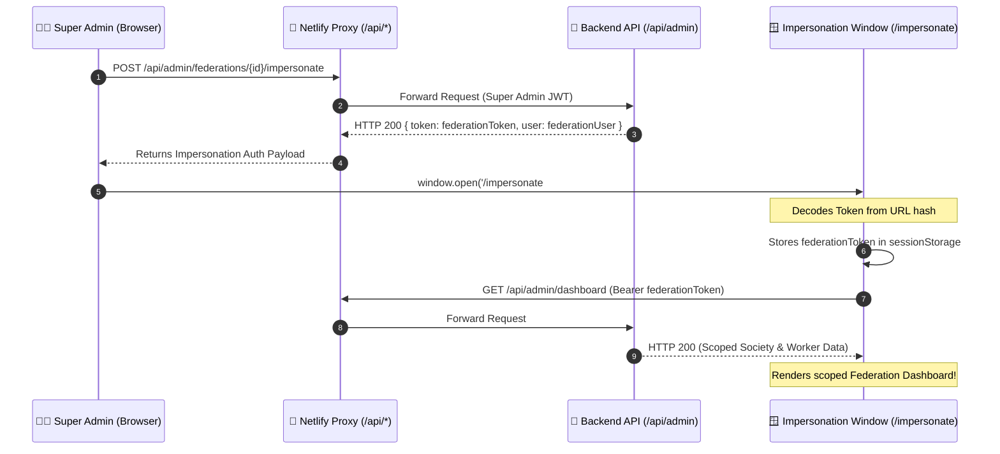

# 💻 Fixly Admin Panel — Cooperative Governance & Operations Dashboard

[](https://react.dev/)
[](https://vitejs.dev/)
[](https://tailwindcss.com/)
[](https://leafletjs.com/)
[](https://recharts.org/)
[](https://lucide.dev/)
[](https://www.netlify.com/)
[](https://aws.amazon.com/)

---

## How this folder is built

`src/main.jsx` boots React. `src/App.jsx` is the route table. A guest hits `/login`. After login, `ProtectedRoute` wraps `Layout` (sidebar + header) and the page.

Repo map: [../README.md](../README.md). The desk talks only to the Node API. Federation admins see one cooperative because the API filters them. Hiding a button here is not the security check.

| Folder | What it does |
|--------|----------------|
| `src/pages/` | One folder per screen: Dashboard, Bookings, Workers, Approvals (KYC), Customers, Services, Payments, Insurance, Reviews, Reports, Analytics, AI Insights, Notifications, Support, Settings (keys + force-update), Federations, Language, Theme preview. |
| `src/components/` | Shared pieces. `layout/` is the frame. `map/WorkersLeafletMap.jsx` is the OpenStreetMap worker map. `charts/` is Recharts. `modals/` assigns a worker, reschedules, sends a notice, dispatches SOS. `auth/RequireRole.jsx` hides a block by role. |
| `src/services/api.js` | Axios. Attaches the admin JWT. On Netlify, `/api` is proxied so the browser stays on HTTPS. |
| `src/context/` | `AppContext` (logged-in admin and role), `LanguageContext` (English/Hindi), `ToastContext`. |
| `src/data/` | Sample rows and translation strings. If a number never changes after a real booking, that page is still reading this folder instead of the API. |
| `src/views/` | Older screen bodies. `App.jsx` mounts `src/pages/`. A fix only in `views/` does nothing if the route uses `pages/`. |
| `src/utils/` | Map center for an Indian state or district. |
| `public/` | Logo and Netlify `_redirects` so deep links still load the app. Proxy rules are in `netlify.toml`. |

---

## 📌 Executive Overview

The **Fixly Admin Web Dashboard** is a high-performance, responsive Single-Page Application (SPA) built with **React 18**, **Vite 5**, and **Tailwind CSS**. It serves as the primary nerve center for the **Fixly Gig-Worker Cooperative Platform**, enabling cooperative federations, district societies, and super-administrators to monitor operations, arbitrate disputes, audit KYC compliance, and ensure 100% fair-wage escrow distribution.

Deployed on **Netlify**, the dashboard communicates seamlessly with the **AWS ECS Fargate Modular Monolith** through Netlify's high-speed edge reverse proxy, eliminating Browser Mixed Content (`HTTPS` ➔ `HTTP`) and Cross-Origin Resource Sharing (CORS) overhead.

### Key Capabilities
1. **Multi-Tenant Cooperative Governance**: Hierarchical administration across State Federations, District Cooperative Societies, and Primary Units.
2. **Role-Based Access Control (RBAC)**: Distinct permissions for `super_admin` and `federation_admin` with instant one-click society impersonation.
3. **Real-Time Geospatial Operations**: Interactive OpenStreetMap Leaflet map displaying active gig workers, live GPS coordinates, and instant SOS emergency dispatch.
4. **KYC & Trade Certification Verification**: End-to-end audit pipeline for worker Aadhaar identity, trade licenses, and police clearance certificates.
5. **Fair-Wage Escrow & Financial Auditing**: Double-entry ledger tracking, Razorpay payment reconciliation, cooperative welfare deductions, and instant worker UPI payouts.
6. **Live Support Arbitration Desk**: Real-time ticket management with AI-bot resolution and human supervisor takeover.
7. **Mobile App Release & Force-Update Management**: Over-The-Air (OTA) semver controls, mandatory APK force-update enforcement, and instant Redis cache invalidation.
8. **Bilingual Interface**: Native English and Hindi localization with one-click language switching.

---

## 📐 System & Network Architecture



---

## 🔀 Netlify Reverse Proxy & Zero-CORS Setup

When deployed to production on Netlify over `HTTPS`, calling an `HTTP` Application Load Balancer directly triggers browser **Mixed Content Security Errors** and preflight **CORS blocks**.

Fixly solves this by leveraging Netlify's high-performance edge rewrite engine in `netlify.toml`:

```toml
# Netlify Configuration for Fixly Admin Panel
[build]
  publish = "dist"
  command = "npm run build"

# Proxy /api calls to AWS ALB to avoid Browser Mixed Content (HTTPS -> HTTP) blocking
[[redirects]]
  from = "/api/*"
  to = "http://fexily-lb-380632449.ap-south-1.elb.amazonaws.com/api/:splat"
  status = 200
  force = true

# SPA fallback routing
[[redirects]]
  from = "/*"
  to = "/index.html"
  status = 200
```

### Axios BaseURL Resolution (`src/services/api.js`)
The API connector dynamically chooses the optimal endpoint:
- **Localhost Development**: Routes to `http://localhost:8000/api/admin` or reads `VITE_API_URL`.
- **Production (Netlify HTTPS)**: Automatically rewrites backend calls to relative `/api/admin`, allowing the Netlify reverse proxy to handle the outbound forward to AWS.

```javascript
let envBase = import.meta.env.VITE_API_URL;
const isLocal = typeof window !== 'undefined' && 
  (window.location.hostname === 'localhost' || window.location.hostname === '127.0.0.1');

if (typeof window !== 'undefined' && window.location.protocol === 'https:' && envBase && envBase.startsWith('http://')) {
  envBase = '/api/admin';
}

const API_BASE_URL = envBase || (isLocal ? 'http://localhost:8000/api/admin' : '/api/admin');
```

---

## 🧩 Component & State Management Architecture



---

## 🔐 Role-Based Access Control (RBAC) & Federation Impersonation

The Admin Panel enforces strict role segregation through the `RequireRole` guard:

| Role | Scope | Key Permissions |
| :--- | :--- | :--- |
| **`super_admin`** | Platform-Wide | Full administrative control, Federation approvals/suspensions, Impersonation (`/impersonate`), language controls, platform commission rates, welfare percentage adjustments, and Redis cache purges. |
| **`federation_admin`** | Regional / District | Scoped strictly to affiliated Primary Cooperative Societies, local gig-worker onboarding, local dispute settlement, and regional demand forecasting. |

### Super Admin Federation Impersonation Flow

Super-administrators can effortlessly impersonate regional federation managers to audit local dashboards without needing passwords:



---

## 📱 Comprehensive Feature Modules

### 1. 📊 Executive Dashboard (`/dashboard`)
- **Key Metrics Overview**: Real-time counter cards for Total Revenue, Active Bookings, Registered Workers, and Verified Customers.
- **Visual Revenue Growth**: Interactive multi-period Recharts area graph (Today, Weekly, Monthly, Yearly).
- **Recent Bookings Stream**: Live table showing immediate status flags (`pending`, `confirmed`, `in_progress`, `completed`).
- **Emergency SOS Alert Ticker**: Immediate red alert banner triggered when a gig worker activates the panic button.

### 2. 🗺️ Real-Time Worker GPS Map (`WorkersLeafletMap.jsx`)
- Built on top of **Leaflet** and **OpenStreetMap**.
- Real-time conversion of GeoJSON `[longitude, latitude]` arrays to Leaflet `[lat, lng]` coordinates.
- Filter pins dynamically by service trade (Plumber, Electrician, Carpenter, Cleaning, etc.).
- Direct click-to-dispatch: Click any worker marker on the map to inspect their current status, phone, rating, or assign them to open bookings.

### 3. 📋 KYC Verification & Worker Approvals (`/approvals`)
- Dedicated audit desk for newly registered gig workers.
- Side-by-side inspection of submitted Aadhaar photo cards, trade diplomas, and police clearance certificates via Cloudinary CDN previews.
- **One-Click Actions**: Approve (`isVerified: true`) or Reject with mandatory audit reason logged to MongoDB.

### 4. 📅 Booking Management & Lifecycle Dispatch (`/bookings`)
- Comprehensive booking state machine inspector.
- **Assign Worker Modal**: Automatically calculates and ranks nearby verified workers based on MongoDB 2dsphere proximity.
- **Reschedule & Cancellation Controls**: Admin override with automated customer refund or cancellation fee computation.
- **Itemized Invoice Modal**: Real-time PDF/print preview of job labor charges, spare parts billed with OTP authorization, and GST breakdowns.

### 5. 💳 Escrow, Payments & Worker Wallet Payouts (`/payments`)
- **Double-Entry Ledger Tracking**: Monitors transaction states across Customer Escrow, Platform Commission (5%), and Cooperative Welfare Fund (5%).
- **Razorpay Order Reconciliation**: Signature validation and payment gateway status checks.
- **Worker Payout Disbursement**: Approves bank transfer and UPI withdrawal requests from worker wallets with automated balance deductions.

### 6. 🛡️ Gig Worker Welfare & Micro-Insurance (`/insurance`)
- Tracks health and term life micro-insurance policies issued for cooperative workers.
- Manages welfare relief claims (accident coverage, emergency illness grants).
- Repository of e-Shram social security scheme PDFs and claim filing forms.

### 7. 🏛️ Cooperative Federations & Primary Societies (`/federations`)
- Multi-tier cooperative federation directory (State Federations ➔ District Cooperative Societies).
- Society creation, worker membership quota management, and society leader appointments.
- Impersonation shortcut to open regional society dashboards instantly.

### 8. 🎧 Real-Time Support Arbitration Desk (`/support`)
- Dispute arbitration center for order discrepancies and customer complaints.
- Real-time conversation stream: Inspect transcripts generated by Fixly's automated AI support bot.
- **One-Click Agent Takeover**: Admin can click "Takeover Ticket" to disable bot responses and chat directly with the customer.

### 9. 📈 Analytics, Reports & AI Demand Forecasting (`/analytics`, `/ai-insights`)
- **Demand Forecasting**: Visualizes peak-hour service demand predictions powered by the backend AI engine.
- **Worker Reliability Heatmaps**: Category-wise fulfillment rates and worker attendance statistics.
- **Automated Report Generation**: One-click CSV and printable ledger export for accounting and government cooperative compliance audits.

### 10. 🔔 Targeted Push Notifications Broadcast (`/notifications`)
- Broadcasts instant push notifications to the mobile app fleet using Firebase Cloud Messaging (FCM).
- **Audience Filtering**: Target All Users, Customers Only, Active Gig Workers, or specific geographic districts.

### 11. ⚙️ Platform Governance, OTA App Version & Redis Flush (`/settings`)
- **Platform Fee Sliders**: Dynamically tune platform commission % and cooperative welfare contribution %.
- **Over-The-Air (OTA) Mobile App Versioning**:
  - Sets `currentAppVersion`, `minSupportedVersion`, and `updateUrl` (APK direct download link).
  - Toggles `forceUpdate`: Immediately forces Flutter mobile clients below `minSupportedVersion` into non-dismissible update mode.
- **Redis Cache Flusher**: One-click buttons to flush version cache, catalog cache, or perform a total memory wipe (`/api/admin/redis/clear/all`).

### 12. 🌐 Bilingual Localization (`/language-control`)
- Instant switching between **English** and **Hindi (हिन्दी)**.
- Centralized dictionary in `src/data/translations.js` mapped across all sidebar items, modal forms, status badges, and table headers.

---

## 🗂️ Project Directory Structure

```text
FIXLY ADMIN PANEL/
├── public/                       # Static public assets (Favicons, logos)
├── src/
│   ├── components/               # Modular UI Components
│   │   ├── auth/                 # Route guards (RequireRole.jsx)
│   │   ├── charts/               # Recharts wrappers (BookingsOverview, RevenueGrowth)
│   │   ├── common/               # UI Primitives (Avatar, Badge, Modal, Pagination)
│   │   ├── layout/               # Shell components (Header.jsx, Layout.jsx, Sidebar.jsx)
│   │   ├── map/                  # Leaflet map components (WorkersLeafletMap.jsx)
│   │   └── modals/               # 8+ Action modals (AddWorker, AssignWorker, Invoice, etc.)
│   ├── context/                  # React Contexts
│   │   ├── AppContext.jsx        # Central state, entity stores, and auth logic
│   │   ├── LanguageContext.jsx   # Bilingual EN/HI language switcher
│   │   └── ToastContext.jsx      # Flash notification system
│   ├── data/                     # Mock data, India geo JSON, and dictionary translations
│   │   ├── indiaStatesDistricts.json
│   │   └── translations.js       # Hindi and English translation dictionary
│   ├── pages/                    # 20+ Administrative Route Pages
│   │   ├── AIInsights/           # Demand predictions & AI insights
│   │   ├── Analytics/            # Platform KPI charts & volume trends
│   │   ├── Approvals/            # Worker Aadhaar & trade KYC approvals
│   │   ├── Auth/                 # Login & Super Admin Impersonation pages
│   │   ├── Bookings/             # Booking operations & dispatch management
│   │   ├── Customers/            # Customer directory & detail drawer
│   │   ├── Dashboard/            # Main administrative executive overview
│   │   ├── Federations/          # Cooperative federations & primary societies
│   │   ├── Insurance/            # Worker micro-insurance & welfare claims
│   │   ├── LanguageControl/      # Multi-lingual settings
│   │   ├── Notifications/        # FCM push notification broadcast desk
│   │   ├── Payments/             # Escrow settlements & UPI payouts
│   │   ├── Reports/              # Financial ledgers & exportable statements
│   │   ├── Reviews/              # Customer & worker rating moderation
│   │   ├── Services/             # Service catalog & federation wage floors
│   │   ├── Settings/             # Commission sliders, App Version & Redis flush
│   │   ├── Support/              # Support arbitration chat & AI takeover
│   │   └── Workers/              # Worker roster, profiles, and 2dsphere coordinates
│   ├── services/                 # API Client
│   │   └── api.js                # Axios instance, JWT interceptors, 50+ API methods
│   ├── App.jsx                   # Application routing and protected route tree
│   ├── index.css                 # Tailwind CSS styles & theme color tokens
│   └── main.jsx                  # React DOM client entry point
├── .env.development              # Development environment configuration
├── .env.production               # Production configuration for Netlify build
├── index.html                    # HTML shell & font definitions
├── netlify.toml                  # Netlify build settings & AWS reverse proxy rules
├── package.json                  # Dependencies & npm scripts
├── postcss.config.js             # PostCSS plugins
├── tailwind.config.js            # Custom Tailwind color tokens and theme scale
└── vite.config.js                # Vite build engine & React plugin configuration
```

---

## ⚙️ Environment Variables Reference

### Development (`.env.development` / `.env`)
```env
# Local development backend API endpoint
VITE_API_URL=http://localhost:8000/api/admin
```

### Production on Netlify (`.env.production`)
```env
# Production uses the Netlify reverse proxy to prevent Mixed Content & CORS errors
VITE_API_URL=/api/admin
```

---

## 🛠️ Local Development & Production Runbook

### 1. Prerequisites
- **Node.js**: `20.x` LTS recommended
- **npm**: `10.x` or higher

### 2. Install Dependencies
```bash
cd "FIXLY ADMIN PANEL"
npm install
```

### 3. Run Development Server
```bash
npm run dev
```
The application will spin up at `http://localhost:5173`.

### 4. Build for Production
```bash
npm run build
```
Vite compiles the production bundle into the `dist/` folder with minification and CSS tree-shaking.

### 5. Preview Production Build Locally
```bash
npm run preview
```

### 6. Netlify Production Deployment
The project is configured for continuous zero-config deployment on Netlify:
- **Build Command**: `npm run build`
- **Publish Directory**: `dist`
- **Configuration File**: Automatically detected from `netlify.toml`.

To deploy manually via the Netlify CLI:
```bash
npm install -g netlify-cli
netlify login
netlify deploy --prod --dir=dist
```

---

## 🎨 Theme & Brand Styling Guide

The Fixly Admin Panel utilizes a modern design language with high accessibility contrast and clear status tokens:

| Token | Hex Value | Usage |
| :--- | :--- | :--- |
| **Primary Brand (Fixly Blue)** | `#01668F` | Active nav items, primary action buttons, branding badges. |
| **Accent (Vibrant Orange)** | `#FD6E01` | SOS alerts, pending state warnings, call-to-action highlights. |
| **Background (Light Slate)** | `#F8FAFB` | Main application shell background. |
| **Card Surface** | `#FFFFFF` | Elevated containers, tables, and modal dialogs. |
| **Status Confirmed** | `#01668F` | Accepted and verified states. |
| **Status Pending** | `#FD6E01` | Awaiting worker assignment or KYC review. |
| **Status Cancelled** | `#DC2626` | Failed jobs or rejected credentials. |

---

<div align="center">
  <sub>Engineered for the Fixly Gig-Worker Cooperative Federation Platform.</sub>
</div>
