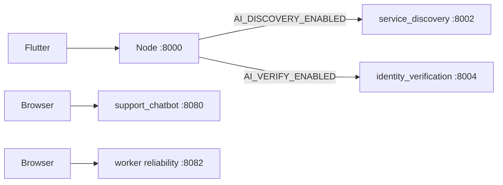

# `ai_ml` — Python helpers

These programs are **not** the phone app and **not** the Node API. They answer one hard question each. Node calls two of them. The other two are demos you can open in a browser.

Repo map: [../README.md](../README.md).



`start_all.py` starts four programs. Each stays on its own port because two are FastAPI and two are Python’s built-in HTTP server. They are not merged into one app.

| Folder | Port | How it starts | Who calls it |
|--------|------|----------------|--------------|
| `service_discovery/` | 8002 | uvicorn `discovery_api:app` | Node, when `AI_DISCOVERY_ENABLED=true` |
| `identity_verification/` | 8004 | uvicorn `app:app` | Node KYC, when `AI_VERIFY_ENABLED=true` |
| `support_chatbot/` | 8080 | `run_server.py` | Browser demo. The phone support chat uses Node `/api/support`, not this port |
| `worker_Reliability_Score/` | 8082 | `run_server.py` | Browser demo and the scoring lab |

The comment at the top of `start_all.py` also mentions worker matching on 8003 and fair price on 8081. Those folders are not in this repo and are not in the `SERVICES` list.

### Service discovery (`service_discovery/`, port 8002)

Customer types “kitchen pipe is leaking”. `POST /discover` with `{ "text" }` runs a saved TF-IDF vectorizer (`vectorizer.pkl`) and classifier (`service_classifier.pkl`). The JSON answer is `suggested_category` plus the top 3 matches. `train_classifier.py` rebuilds the pickles. Node maps that category onto a Mongo `Service`. The phone calls Node, not port 8002.

### Identity check (`identity_verification/`, port 8004)

`POST /verify` takes `documentUrl` and `selfieUrl` (usually Cloudinary links Node already stored). `app.py` downloads both images, scores sharpness, then DeepFace compares the faces. It does not write Mongo. Node saves the result. A federation admin can still approve a borderline case in the React Approvals page.

### Support chatbot (`support_chatbot/`, port 8080)

Demo bot. Open `http://127.0.0.1:8080/demo/index.html`.

`gig_support_chatbot/core/` is the conversation engine and intent matcher. `data/` is in-memory FAQ and ticket text for the demo, not the live Mongo database. `i18n/` is English and Hindi. `server/` is the HTTP API. `tests/` covers the matcher, FAQs, and the widget contract. Do not assume a phone message hits 8080. That wire is not in `backend/server.js`.

### Worker reliability (`worker_Reliability_Score/`, port 8082)

Demo: `http://127.0.0.1:8082/demo/index.html`.

`gig_worker_reliability/core/engine.py` scores a worker from five parts that add up to 1: on time 0.25, completion 0.25, feedback 0.20, cancellation 0.15, response time 0.15. Older jobs fade out. Default half-life is 30 days. A new worker with no jobs goes through cold-start so the score is not stuck at zero. `ml/` trains a risk model on generated rows. Live job matching in production still uses Mongo plus `backend/services/eligibleWorkers.js`.

```bash
cd ai_ml
python3 start_all.py
```

Backend `.env` when you want Node to use the first two:

```
AI_DISCOVERY_ENABLED=true
AI_VERIFY_ENABLED=true
SERVICE_DISCOVERY_URL=http://127.0.0.1:8002
IDENTITY_VERIFY_URL=http://127.0.0.1:8004
```

Free hosts sleep. [`.github/workflows/ml-keepalive.yml`](../.github/workflows/ml-keepalive.yml) pings health URLs from the `ML_KEEPALIVE_URLS` secret.
