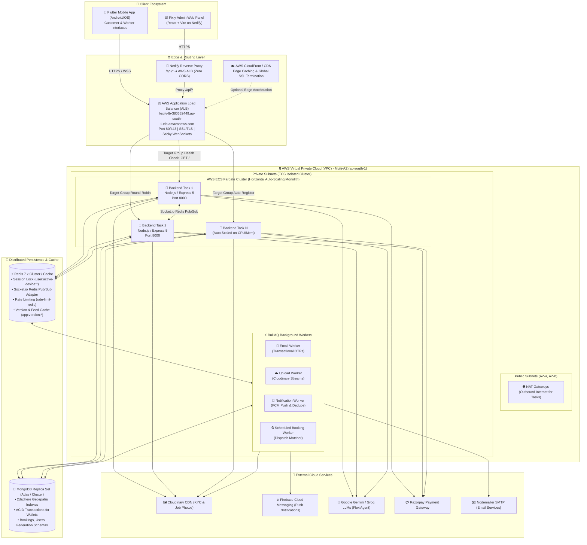
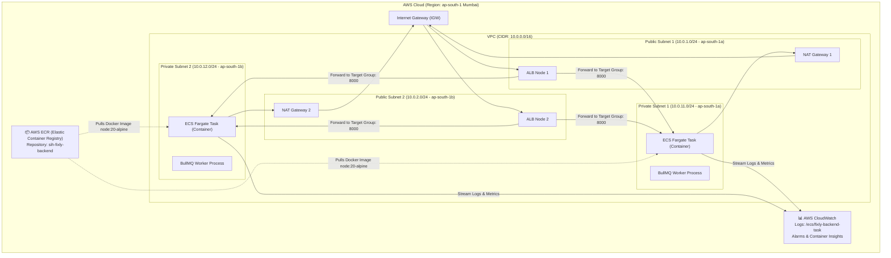
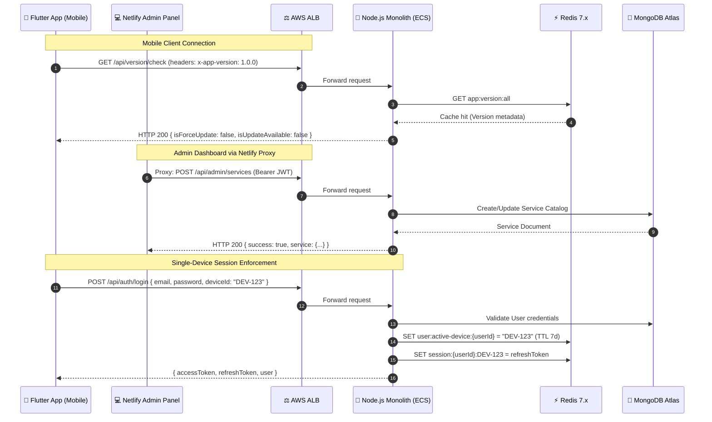
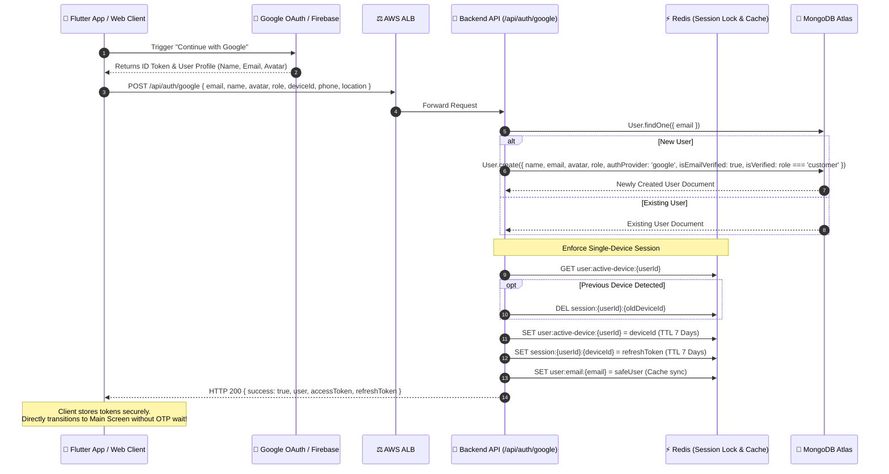
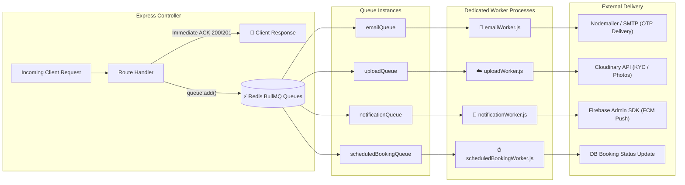
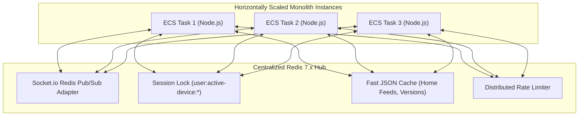
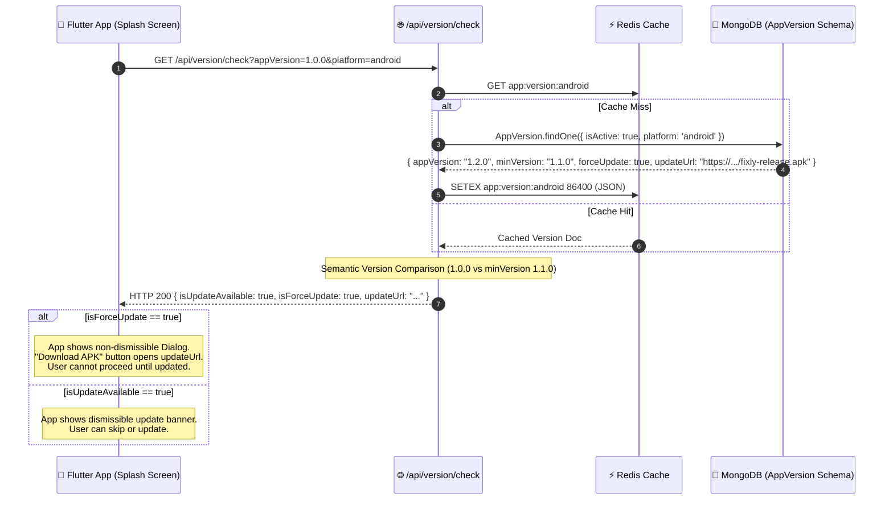
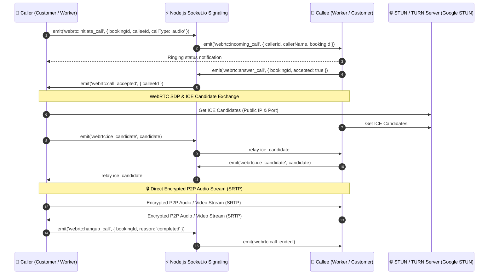

# 🛠️ Fixly Backend — Enterprise Modular Monolith Architecture

[](https://nodejs.org/)
[](https://expressjs.com/)
[](https://www.mongodb.com/)
[](https://redis.io/)
[](https://docs.bullmq.io/)
[](https://aws.amazon.com/)
[](https://www.docker.com/)
[](https://socket.io/)
[](https://webrtc.org/)
[](https://cloudinary.com/)
[](https://www.netlify.com/)

---

## 📌 Executive Overview

**Fixly** (GigConnect Platform) is an on-demand home service and gig-worker cooperative platform. The backend is designed as an **Enterprise-Grade Modular Monolith** engineered for **stateless horizontal scalability** on **Amazon Web Services (AWS)**.

The system powers:
1. **Flutter Mobile Applications** (Customer & Gig Worker apps) with real-time GPS tracking, in-app WebRTC masked audio/video calls, and instant booking workflows.
2. **Flexible Dual Authentication**: Email + Password with 6-digit verification OTP, and seamless one-tap **"Continue with Google" (OAuth2 / Firebase Auth)** with device-bound session enforcement.
3. **Fixly Admin Web Dashboard** (React/Vite) hosted on **Netlify**, communicating with the backend through an **Application Load Balancer (ALB)** reverse-proxy.
4. **Automated Asynchronous Background Queues** (BullMQ + Redis) for OTP delivery, push notifications, Cloudinary asset uploads, and scheduled job dispatches.
5. **AI-Powered Conversational Booking Agent** (FlexiAgent) with multi-lingual slot extraction, dynamic database category matching, and fair-wage fare estimation.
6. **OTA & In-App APK Dynamic Version Management** with zero-downtime Redis caching, semantic version evaluation, and mandatory force-update enforcement.

---

## 📐 High-Level System Architecture



---

## ☁️ AWS Cloud Infrastructure Deep Dive

The production infrastructure runs within a dedicated **AWS Virtual Private Cloud (VPC)** designed following the AWS Well-Architected Framework:



### 1. VPC Architecture (Public & Private Subnets)
- **Multi-AZ Redundancy**: Subnets distributed across `ap-south-1a` and `ap-south-1b` for high availability.
- **Public Subnets**: Host the Internet-facing Application Load Balancer and NAT Gateways. Direct public access is allowed strictly on ports 80/443 through AWS Security Groups.
- **Private Subnets**: Host all backend compute tasks (ECS Fargate containers and BullMQ workers). Containers have **no public IP addresses**, preventing unauthorized ingress.
- **NAT Gateways**: Enable private containers to communicate outbound with MongoDB Atlas, Redis, Firebase, Cloudinary, and external APIs while remaining shielded from direct inbound internet attacks.

### 2. Application Load Balancer (ALB) & Target Groups
- **DNS Endpoint**: `http://fexily-lb-380632449.ap-south-1.elb.amazonaws.com`
- **Listeners**:
  - `HTTP :80` ➔ Redirects or forwards to Target Group.
  - `HTTPS :443` ➔ SSL/TLS Termination using AWS Certificate Manager (ACM).
- **Target Group Configuration**:
  - **Protocol**: HTTP / Port 8000
  - **Target Type**: `ip` (AWS Fargate awsvpc networking mode)
  - **Health Check Path**: `GET /` (Expects HTTP 200 `{ "status": "success", "message": "GigConnect API Platform is active" }`)
  - **Health Interval**: 15 seconds, Timeout: 5 seconds, Healthy Threshold: 2, Unhealthy Threshold: 3
  - **Sticky Sessions**: Enabled with Duration-based cookie (`AWSELB`) for seamless WebSocket connection upgrades.

### 3. AWS ECR (Elastic Container Registry)
- Stores production Docker images with SHA-based immutable tags and automated CVE security vulnerability scanning.
- Base image: `node:20-alpine` (lightweight, minimal attack surface).

### 4. AWS ECS (Elastic Container Service) with Fargate
- **Launch Type**: AWS Fargate (Serverless compute, no EC2 patching required).
- **Task Definition**:
  - Memory: `1024 MB` (1 GB)
  - CPU: `512 vCPU units` (0.5 vCPU)
  - Network Mode: `awsvpc`
  - Logging: `awslogs` driver sending stdout/stderr to CloudWatch Logs.
- **Horizontal Auto-Scaling Policies**:
  - **Scale-Out Trigger**: Average CPU utilization exceeds **70%** for 2 consecutive minutes, or Memory exceeds **75%**.
  - **Scale-In Trigger**: CPU utilization drops below **30%** with a 300s cooldown period to prevent thrashing.
  - **Capacity Limits**: Min Capacity: `2 tasks` (spread across 2 AZs), Max Capacity: `10 tasks`.

### 5. AWS CloudWatch Monitoring & Alerts
- **Centralized Log Group**: `/ecs/fixly-backend-task`
- **Alarms**:
  - `High-5xx-Error-Rate`: Triggers alert if 5xx responses exceed 2% of total traffic.
  - `High-Latency`: Triggers if target response time exceeds 1.5 seconds.
  - `Container-Crash-Loop`: Triggers on unexpected task exit codes.

---

## 📱 Multi-Client Ecosystem Integration



### 1. Flutter Mobile App (Customer & Gig Worker)
- Connects directly to the AWS ALB (`/api/*` and WSS `/socket.io/*`).
- Identifies itself via device UUIDs (`deviceId`) using `react-native-device-info` or `device_info_plus`.
- Performs real-time WebSocket handshake for live GPS tracking, in-app push alerts, and WebRTC calls.

### 2. Fixly Admin Dashboard (Hosted on Netlify)
- Built with React & Vite, published on Netlify (`publish = "dist"`).
- Uses Netlify's high-performance edge redirects to eliminate Browser Mixed Content (HTTPS ➔ HTTP) and CORS errors:
  ```toml
  # FIXLY ADMIN PANEL/netlify.toml
  [[redirects]]
    from = "/api/*"
    to = "http://fexily-lb-380632449.ap-south-1.elb.amazonaws.com/api/:splat"
    status = 200
    force = true

  [[redirects]]
    from = "/*"
    to = "/index.html"
    status = 200
  ```

### 3. Authentication Architecture: "Continue with Google" & Multi-Device Security

Fixly provides a hybrid authentication flow supporting both standard email credentials and one-tap **"Continue with Google"** (`POST /api/auth/google`), with zero friction and guaranteed device security:



#### Key Advantages of "Continue with Google" in Fixly:
- **Instant Onboarding**: Bypasses the 6-digit email OTP step since Google OAuth natively verifies email ownership (`isEmailVerified: true`).
- **Role-Aware Auto Verification**:
  - `customer`: Automatically activated (`isVerified: true`) for instant service booking.
  - `worker`: Requires cooperative administrator KYC approval (`isVerified: false`) before receiving gig dispatch alerts.
- **Single-Device Protection**: Even with social sign-in, binding the `deviceId` to Redis prevents fraudulent multi-phone account sharing.
- **Live Avatar & Name Synchronization**: Seamlessly pulls Google profile photo and displays it across active bookings and worker identification cards.

---

## ⚡ Asynchronous Background Processing (BullMQ + Redis)

To ensure the Express event loop remains non-blocking (< 50ms API latency), all resource-heavy operations are offloaded to **BullMQ** job queues:



### Queue Capabilities & Responsibilities
| Queue Name | Worker File | Trigger Event | Operation / SLA |
| :--- | :--- | :--- | :--- |
| `emailQueue` | `emailWorker.js` | User Registration, Forgot Password | Formats HTML OTP email template and sends via SMTP with exponential backoff retries. |
| `uploadQueue` | `uploadWorker.js` | Worker KYC documents, Aadhaar, before/after job photos | Stream buffers directly to Cloudinary folder hierarchies (`fixly/kyc/`, `fixly/avatars/`) and updates Mongo document. |
| `notificationWorker` | `notificationWorker.js` | Booking Accepted, Worker Dispatched, Payment Done | Emits FCM payload with unique deduplication key (`dedupeKey`) to prevent duplicate notifications. |
| `scheduledBookingWorker` | `scheduledBookingWorker.js` | Time-based scheduled booking window approaches | Evaluates bookings scheduled for the next 15-30 minutes, matches eligible nearby workers, and broadcasts alerts. |

---

## 🚀 Horizontal Scaling Mechanics of the Monolith

Even though the codebase is structured as a clean modular monolith, it scales **linearly** like microservices through stateless design:



1. **Stateless JWT Authentication**: Every request verifies the Bearer JWT statelessly without querying database disks for every single micro-interaction.
2. **Single-Device Session Locking (`redis.set('user:active-device:<id>', deviceId)`)**: If a worker or customer logs into a new device, the previous device's active session is invalidated in Redis instantly.
3. **Socket.io Redis Adapter**:
   - When Customer connects to **ECS Task 1** and Worker connects to **ECS Task 2**, live GPS coordinate tracking and WebRTC signaling messages are relayed over Redis Pub/Sub channels (`@socket.io/redis-adapter`), eliminating instance-affinity lock-in.
4. **Geospatial Queries with MongoDB 2dsphere**:
   - Indexed queries (`coordinates: { $nearSphere: { $geometry: ... } }`) calculate nearby active workers within dynamic operational radii (e.g. 5–15 km) in sub-10ms.

---

## 📦 App Version Management & In-App APK Force Update System

The backend features a zero-downtime version inspection engine that manages Over-The-Air (OTA) notices and mandatory APK force updates for the Flutter mobile application.



### Version Check API Payload
**`GET /api/version/check?appVersion=1.0.0&platform=android`**

```json
{
  "success": true,
  "data": {
    "isMatch": false,
    "isUpdateAvailable": true,
    "isForceUpdate": true,
    "currentApiVersion": "V1",
    "currentAppVersion": "1.2.0",
    "minSupportedVersion": "1.1.0",
    "clientAppVersion": "1.0.0",
    "updateTitle": "Update Required",
    "updateMessage": "A new version of Fixly is available with security enhancements. Please update.",
    "updateUrl": "https://storage.googleapis.com/fixly-releases/fixly-release-v1.2.0.apk",
    "platform": "android"
  }
}
```

### Admin Cache Clear Endpoints
To push an update immediately without waiting for the 24-hour Redis TTL to expire:
- `POST /api/version/redis/clear` (Clears version cache)
- `POST /api/version/redis/clear/all` (Flushes application-level Redis cache safely)

---

## 📞 Real-Time WebRTC Masked VoIP Calling Architecture

Fixly protects the privacy of customers and gig workers by facilitating **in-app VoIP calls** using WebRTC peer connections. Personal phone numbers are never exposed.



---

## 🗂️ Codebase Directory Structure

```text
backend/
├── agent/                         # FlexiAgent AI Conversational Booking Engine
│   ├── config/                    # LLM configuration (Gemini 2.5 Flash / Groq)
│   ├── graph/                     # LangGraph StateGraph, FSM router & execution nodes
│   ├── prompts/                   # Strict system prompts and guardrail definitions
│   └── services/                  # Worker matching, slot extractors, and locators
├── config/                        # Infrastructure Connectors
│   ├── db.js                      # MongoDB connection pool with retry resilience
│   ├── firebase.js                # Firebase Admin SDK (FCM and Google Auth)
│   ├── nodemailer.js              # SMTP transport setup
│   ├── redis.js                   # Redis connection & duplicate client factory
│   └── socket.io                  # Socket.io server with Redis adapter
├── controllers/                   # REST API Business Logic
│   ├── activeJobController.js     # OTP verification, invoice itemization, job lifecycle
│   ├── adminController.js         # Federation management, system controls, analytics
│   ├── agentController.js         # FlexiAgent chat & Live voice integration
│   ├── appVersionController.js    # OTA updates, semver check, APK download distribution
│   ├── authController.js          # Multi-device session JWT authentication
│   ├── bookingController.js       # On-demand, SOS, and scheduled booking flows
│   ├── paymentController.js       # Escrow settlement, Razorpay hooks, wallet payouts
│   ├── supportController.js       # Real-time arbitration chat with human escalation
│   ├── verificationController.js  # Worker KYC Aadhaar verification pipeline
│   ├── webrtcCallController.js    # Masked call logs and duration audits
│   └── workerWalletController.js  # Cooperative earnings, platform subsidies, withdrawals
├── middleware/                    # HTTP & Pipeline Middlewares
│   ├── authMiddleware.js          # JWT protection & single-device active check
│   ├── rateLimiter.js             # Distributed Redis sliding-window rate limiters
│   └── uploadMiddleware.js        # Multer in-memory streaming
├── models/                        # 22 Mongoose Schemas & 2dsphere Geospatial Indexes
│   ├── AppVersion.js              # OTA semver, minVersion, forceUpdate & APK links
│   ├── Banner.js                  # Promo banners, discount codes & campaign limits
│   ├── Booking.js                 # Complete lifecycle state machine & escrow linkage
│   ├── Cooperative.js             # Cooperative federation registry & legal state
│   ├── CooperativeSociety.js      # District-level cooperative societies
│   ├── EmergencyContact.js        # Emergency SOS helplines (Police, Fire, Ambulance, etc.)
│   ├── InsurancePolicy.js         # Gig worker health & life micro-insurance plans
│   ├── Notification.js            # In-app notifications with deduplication indexes
│   ├── PayoutRequest.js           # Worker wallet withdrawal requests (Bank / UPI)
│   ├── PushToken.js               # Device FCM push tokens per user & deviceId
│   ├── Review.js                  # Bidirectional ratings (Customer ↔ Worker)
│   ├── Service.js                 # Service catalog & federation minimum wage floors
│   ├── Settings.js                # System platform commission & welfare deductions
│   ├── SupportTicket.js           # Dispute tickets with AI bot & admin takeover
│   ├── Transaction.js             # Double-entry ledger (Escrow, Wallet, Payouts)
│   ├── User.js                    # User, Worker & Admin schemas with 2dsphere location
│   ├── VerificationAuditLog.js    # Immutable KYC verification history
│   ├── WebRTCCallLog.js           # In-app masked VoIP call session logs
│   ├── WelfareAccount.js          # Collective worker welfare fund accounts
│   ├── WelfareResource.js         # Welfare aid resources & scheme guidelines
│   ├── WelfareTransaction.js      # Welfare fund contribution ledger
│   └── WorkerCertificate.js       # Trade certifications & verified skill badges
├── queues/                        # BullMQ Distributed Queue Declarations
│   └── queue.js                   # emailQueue & uploadQueue bindings (Redis)
├── routes/                        # 22 Express 5 REST Route Modules
│   ├── admin-routes.js            # System metrics, user bans, dispatch alerts
│   ├── agent-routes.js            # FlexiAgent AI booking chat & Gemini Live audio
│   ├── ai-routes.js               # Demand forecasting & dynamic pricing models
│   ├── app-version-routes.js      # Version checks, APK updates & cache clears
│   ├── auth-routes.js             # Local OTP, Google OAuth & token refresh
│   ├── booking-routes.js          # On-demand, SOS & scheduled service bookings
│   ├── cooperative-routes.js      # Federation registration & society hierarchy
│   ├── emergency-routes.js        # SOS emergency dispatch & public helplines
│   ├── home-routes.js             # Dynamic customer feed & worker stats
│   ├── notification-routes.js     # User notification inboxes & read states
│   ├── payment-routes.js          # Razorpay orders, escrow settlement & webhooks
│   ├── review-routes.js           # Star reviews, feedback & worker score updates
│   ├── service-routes.js          # Public service listings & category rates
│   ├── support-routes.js          # Support arbitration desk & socket chat
│   ├── upload-routes.js           # Multipart document & media uploads
│   ├── user-routes.js             # User profiles, addresses & preferences
│   ├── verification-routes.js     # Worker Aadhaar & document KYC pipeline
│   ├── webrtc-call-routes.js      # Masked VoIP call initiation & history
│   ├── welfare-routes.js          # Welfare claims & cooperative aid payouts
│   ├── worker-certificate-routes.js # Skill certificates & trade licenses
│   ├── worker-routes.js           # 2dsphere nearby worker search & status
│   └── worker-wallet-routes.js    # 100% fair wage earnings & withdrawals
├── services/                      # Decoupled Domain Business Logic
│   ├── aiSupportService.js        # Automated customer support AI resolution
│   ├── couponService.js           # Promo validation, quota caps & subsidies
│   ├── fcmService.js              # Firebase Cloud Messaging push dispatcher
│   ├── notificationService.js     # Notification builder with DB deduplication
│   └── translationService.js      # Multi-lingual dictionary translation
├── sockets/                       # Real-Time WebSocket Handlers
│   ├── tracking.js                # Live worker GPS tracking rooms
│   └── webrtcCallSocket.js        # WebRTC SDP offer/answer & ICE candidate signaling
├── worker/                        # BullMQ Background Job Processors
│   ├── emailWorker.js             # Asynchronous SMTP worker (OTPs & receipts)
│   ├── notificationWorker.js      # Push notification batcher
│   ├── scheduledBookingWorker.js  # Scheduled dispatch runner
│   └── uploadWorker.js            # Cloudinary background asset streamer
├── Dockerfile                     # Multi-stage production container definition
├── package.json                   # Dependencies, scripts, and runtime engines
├── server.js                      # Application bootstrap & graceful shutdown
└── swagger.js                     # OpenAPI/Swagger auto-generation spec
```

---

## 📋 Comprehensive API Route Matrix

| Route Prefix | Controller / Scope | Key Endpoints | Responsibilities |
| :--- | :--- | :--- | :--- |
| `/api/auth` | `authController.js` | `POST /register`, `POST /login`, `POST /verify-otp`, `POST /google`, `POST /refresh-token` | User registration, OTP authentication, "Continue with Google", single-device session locking. |
| `/api/bookings` | `bookingController.js` | `POST /create`, `GET /my-bookings`, `PATCH /:id/cancel`, `POST /apply-coupon` | Booking state machine, coupon subsidies, cancel penalties, escrow allocation. |
| `/api/workers` | `workerController.js` | `GET /nearby`, `PATCH /location`, `PATCH /status`, `GET /profile` | Geospatial 2dsphere worker discovery, online toggle, real-time GPS broadcasting. |
| `/api/active-job` | `activeJobController.js` | `POST /start-job`, `POST /verify-arrival-otp`, `POST /add-parts`, `POST /complete` | Worker arrival OTP check, extra parts approval via customer OTP, final invoice generation. |
| `/api/payments` | `paymentController.js` | `POST /create-order`, `POST /verify-signature`, `GET /escrow/:bookingId` | Razorpay order creation, signature verification, cooperative escrow settlement. |
| `/api/worker-wallet`| `workerWalletController.js` | `GET /balance`, `POST /withdraw`, `GET /transactions` | 100% fair-wage worker earnings, cooperative welfare deductions, bank/UPI transfers. |
| `/api/verification`| `verificationController.js` | `POST /submit-kyc`, `GET /status`, `PATCH /admin/approve` | Aadhaar/document verification, police clearance checks, admin audit log. |
| `/api/version` | `appVersionController.js` | `GET /check`, `POST /`, `POST /redis/clear` | Client semver checking, in-app APK force update redirection, cache flushing. |
| `/api/webrtc` | `webrtcCallController.js` | `POST /call/initiate`, `POST /call/hangup`, `GET /history` | In-app masked VoIP calling records, call duration auditing. |
| `/api/ai/agent` | `agentController.js` | `POST /message`, `POST /reset`, `POST /live-tool` | FlexiAgent conversational booking agent, slot extraction, Gemini Live audio assistance. |
| `/api/support` | `supportController.js` | `GET /active`, `POST /message`, `POST /escalate` | Customer/Worker support chat with automated bot and human desk takeover. |
| `/api/admin` | `adminController.js` | `GET /metrics`, `PATCH /users/:id/ban`, `POST /dispatch-alert` | Platform KPIs, federation auditing, broadcast dispatch notices. |
| `/api/emergency` | `emergencyController.js` | `GET /contacts`, `POST /trigger-sos` | Emergency SOS trigger, notification to nearest contacts & police. |
| `/api/services` | `serviceController.js` | `GET /catalog`, `POST /`, `PUT /:id` | Service catalog management, category definitions, federation wage controls. |
| `/api/reviews` | `reviewController.js` | `POST /create`, `GET /worker/:id` | Bidirectional ratings and reviews (Customer ↔ Worker). |
| `/api/home` | `homeController.js` | `GET /customer-feed`, `GET /worker-dashboard` | Cached personalized home feeds, banner carousels, active jobs. |
| `/api/ai` | `aiController.js` | `GET /demand-forecast`, `POST /smart-pricing` | Machine learning demand predictions & dynamic worker availability. |
| `/api/upload` | `uploadController.js` | `POST /file`, `POST /kyc` | Secure multipart file uploads buffered to Cloudinary CDN. |
| `/api/users` | `userController.js` | `GET /profile`, `PUT /update-profile`, `DELETE /account` | User profile management, address book, preferences. |
| `/api/worker-certificates`| `workerCertificateController.js` | `POST /upload`, `GET /verified` | Worker skill certification uploads & verification badges. |
| `/api/notifications`| `notificationController.js` | `GET /`, `PATCH /:id/read`, `DELETE /:id` | User notification inbox, FCM push history, deduplicated alerts. |
| `/api/cooperative` | `cooperativeController.js` | `GET /federations`, `POST /register-society` | Cooperative society registration, state federation governance. |
| `/api/welfare` | `welfareController.js` | `GET /balance`, `POST /claim`, `GET /schemes` | Gig worker welfare fund balances, relief claims, insurance. |

---

## ⚙️ Environment Variables Reference (`.env`)

```env
# ==============================================================================
# SERVER & INFRASTRUCTURE CONFIGURATION
# ==============================================================================
PORT=8000
NODE_ENV=production
JWT_SECRET=your_jwt_strong_secret_key_here
JWT_ACCESS_EXPIRY=15m
REFRESH_SECRET=your_refresh_token_strong_secret_here
JWT_REFRESH_EXPIRY=7d
REDIS_SESSION_TTL_SEC=604800

# ==============================================================================
# DATABASE & DISTRIBUTED CACHE
# ==============================================================================
MONGO_URI=mongodb+srv://<user>:<password>@cluster.mongodb.net/fixly?retryWrites=true&w=majority
REDIS_URL=redis://default:<password>@<redis-host>:6379

# ==============================================================================
# AWS & CLOUD DEPLOYMENT
# ==============================================================================
AWS_REGION=ap-south-1
AWS_ALB_ENDPOINT=http://fexily-lb-380632449.ap-south-1.elb.amazonaws.com

# ==============================================================================
# CLOUDINARY (MEDIA & KYC DOCUMENT STORAGE)
# ==============================================================================
CLOUDINARY_CLOUD_NAME=your_cloudinary_cloud_name
CLOUDINARY_API_KEY=your_cloudinary_api_key
CLOUDINARY_API_SECRET=your_cloudinary_api_secret

# ==============================================================================
# AI & MACHINE LEARNING (FLEXIAGENT ENGINE)
# ==============================================================================
GEMINI_API_KEY=your_google_gemini_api_key
GROQ_API_KEY=your_groq_llama_api_key

# ==============================================================================
# PAYMENT GATEWAY (RAZORPAY)
# ==============================================================================
RAZORPAY_KEY_ID=rzp_live_your_key_id
RAZORPAY_KEY_SECRET=your_razorpay_key_secret
RAZORPAY_WEBHOOK_SECRET=your_razorpay_webhook_secret

# ==============================================================================
# TRANSACTIONAL EMAIL (NODEMAILER / SMTP)
# ==============================================================================
SMTP_HOST=smtp.gmail.com
SMTP_PORT=465
SMTP_USER=no-reply@fixly.in
SMTP_PASS=your_gmail_app_password_here

# ==============================================================================
# PUSH NOTIFICATIONS (FIREBASE ADMIN SDK)
# ==============================================================================
FIREBASE_SERVICE_ACCOUNT={"type":"service_account","project_id":"fixly-app",...}
```

---

## 🛠️ Local Development & Deployment Runbook

### 1. Run Locally
```bash
# 1. Install dependencies
npm install

# 2. Start local Redis & MongoDB (via Docker or local services)
docker run -d -p 6379:6379 redis:7-alpine

# 3. Generate Swagger API documentation
npm run swagger

# 4. Seed initial categories and federation database
npm run seed

# 5. Start the backend monolith (with BullMQ workers embedded)
npm start
```

### 2. Build & Test Docker Image
```bash
# Build the production-ready Alpine container image
docker build -t fixly-backend:latest .

# Run container locally on port 8000
docker run -p 8000:8000 --env-file .env fixly-backend:latest
```

### 3. Deploy to AWS ECR & Update ECS Fargate Service
```bash
# 1. Authenticate Docker with AWS ECR
aws ecr get-login-password --region ap-south-1 | docker login --username AWS --password-stdin <AWS_ACCOUNT_ID>.dkr.ecr.ap-south-1.amazonaws.com

# 2. Tag image for ECR repository
docker tag fixly-backend:latest <AWS_ACCOUNT_ID>.dkr.ecr.ap-south-1.amazonaws.com/sih-fixly-backend:latest

# 3. Push container image to AWS ECR
docker push <AWS_ACCOUNT_ID>.dkr.ecr.ap-south-1.amazonaws.com/sih-fixly-backend:latest

# 4. Force new deployment on AWS ECS Cluster (Zero-Downtime Rolling Update)
aws ecs update-service \
  --cluster fixly-production-cluster \
  --service fixly-backend-service \
  --force-new-deployment \
  --region ap-south-1
```

---

## 🔒 Security Best Practices Implemented

- **Proxy Header Trust**: `app.set('trust proxy', 1)` enables accurate client IP tracking through AWS ALB for rate limiting.
- **Helmet Protection**: Adds strict HTTP security headers (HSTS, CSP, X-Frame-Options, DNS prefetch control).
- **NoSQL Injection Defense**: Recursive payload sanitizer strips `$`, `{`, and nested query-operator injections across `req.body` and `req.params`.
- **Distributed Brute-Force Rate Limiting**: Redis-backed sliding-window limiters on `/api/auth` (max 15 requests per 15 minutes) and `/api/bookings` (max 100 requests per 15 minutes).
- **CORS Lockdown**: Strict origin evaluation matching authorized Mobile and Netlify dashboard domains.
- **Worker PII Protection**: Real-time payloads sanitize worker phone numbers and private credentials prior to WebSocket broadcast.

---

<div align="center">
  <sub>Engineered with precision for the Fixly Gig-Worker Cooperative Platform.</sub>
</div>
