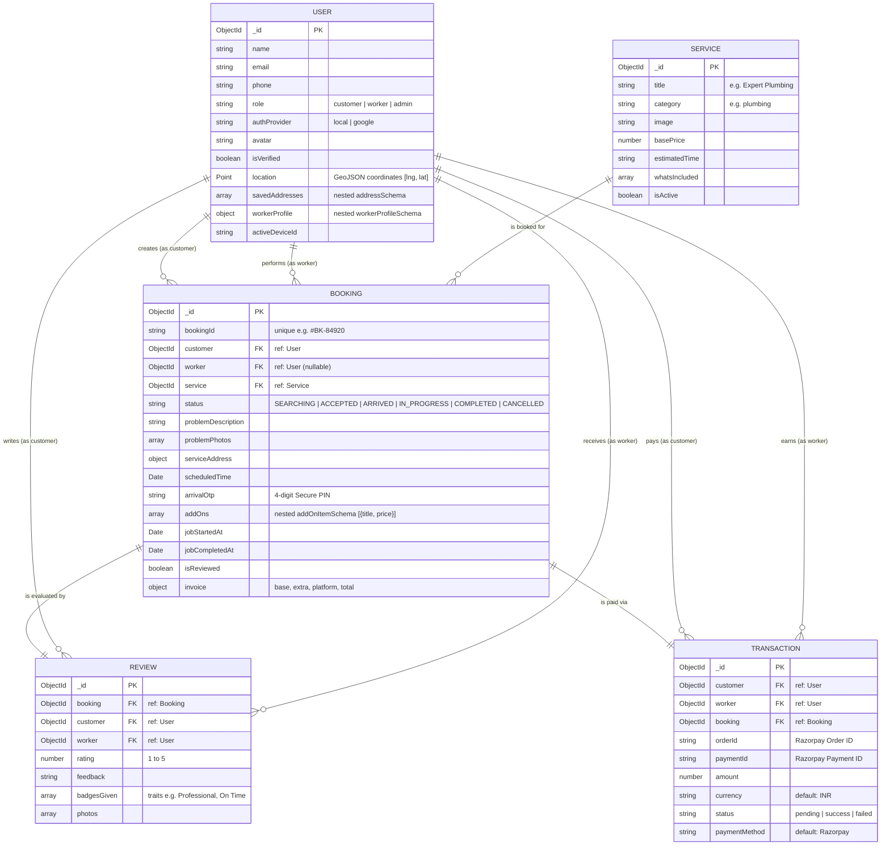
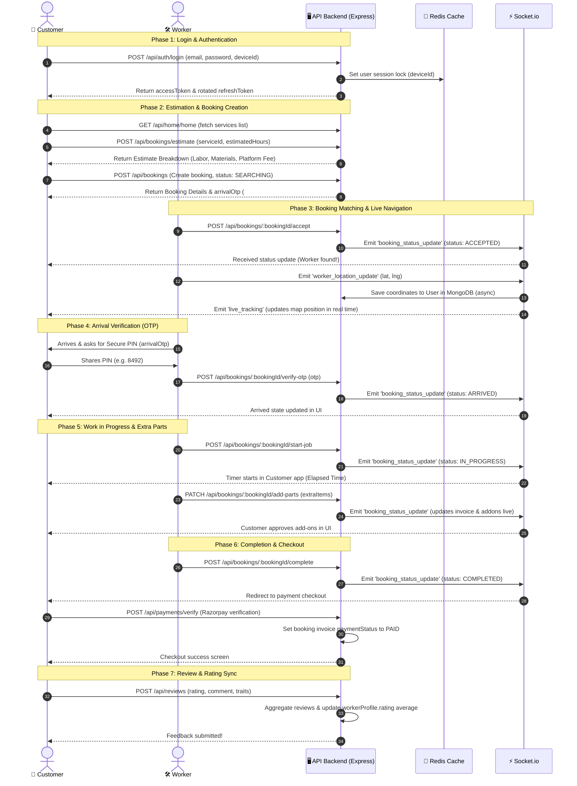

# 📊 GigConnect Database ER-Diagram & Application Workflow Guide

This document provides a detailed breakdown of the **Entity-Relationship (ER) Diagram**, **Schema Connections (Database Relations)**, and the **End-to-End Application Workflow** matching the UI mockups.

---

## 🎨 UI Reference Panels

Below are the UI panels from the application design screens for mapping the databases to the visual workflow:

### Panel 1: Customer Onboarding, Service Selection, and Worker Details


### Panel 2: Live Tracking, Active Work Progress, and Payments


### Panel 3: Worker Interface, Navigation, and Wallet Earnings


---

## 🗺️ Entity-Relationship (ER) Diagram

The following diagram illustrates how all database schemas are connected inside MongoDB:



---

## ⛓️ Detailed Schema Connections & Database Fields

### 1. Unified User Schema (`User` Collection)
MongoDB merges customer and worker details into a single collection to optimize authentication, logins, and session locks.

- **Role Differentiation**: Handled by the `role` enum (`'customer'`, `'worker'`, `'admin'`).
- **GeoJSON Indexing**: `location` maps worker/customer GPS coordinates using MongoDB `2dsphere` spatial index:
  ```json
  "location": { "type": "Point", "coordinates": [77.2090, 28.6139] }
  ```
- **Embedded Document (`workerProfile`)**: For worker accounts, this contains skills, rating, certificates/badges, bio, and hourly rates (saving expensive collection joins on search):
  - `skills` (Array of Strings) - core capabilities (e.g. *Troubleshooting*, *Panel Upgrades*).
  - `certifications` (Array of Strings) - certifications (e.g. *Licensed Electrician*, *Nest Pro*).
  - `badges` (Array of Strings) - operational badges (e.g. *Background Checked*, *Top Rated*).
  - `rating` (Number) - average rating from reviews.
  - `totalJobs` (Number) - total completed bookings.

### 2. Booking Schema (`Booking` Collection)
Binds the customer, worker, and service catalog together to track the lifecycle of the job.

- **`customer`**: References `User` (`_id`) where `role = 'customer'`.
- **`worker`**: References `User` (`_id`) where `role = 'worker'`. Set to `null` while searching, populated upon acceptance.
- **`service`**: References the chosen task in the `Service` collection.
- **`addOns`**: Represents extra parts added during the job (e.g., U-bend pipe). Stores items directly as sub-documents in the booking.
- **`invoice`**: Nested object storing price breakdowns:
  - `baseServiceFee` (Hourly rate $\times$ duration or service base price)
  - `extraPartsTotal` (Sum of prices of all items in `addOns`)
  - `platformFee` (Flat platform commission)
  - `totalAmount` (Sum of `baseServiceFee` + `extraPartsTotal` + `platformFee`)

### 3. Review Schema (`Review` Collection)
Tracks feedback and traits given to workers after job completion.
- **Relationships**: Connects `booking` (1:1), `customer` (Many:1), and `worker` (Many:1).
- **`badgesGiven`**: Maps to the traits select UI list (e.g., *Professional*, *On Time*, *Good Communication*).

### 4. Transaction Schema (`Transaction` Collection)
Manages Razorpay checkout sessions.
- **`orderId`**: Tracks the order ID created by Razorpay.
- **`paymentId`**: Received from Razorpay checkout upon successful payment.
- **`status`**: Maps payments states (`'pending'`, `'success'`, `'failed'`).

---

## 🔄 End-to-End Application Workflow

The diagram below details the operational workflow mapped directly to the UI screens in the panels:



---

## 🖨️ How to Export this Document to PDF

To export this document as a clean, formatted PDF:
1. **VS Code / IDE**:
   - Open this file in your IDE.
   - Install the **Markdown PDF** extension.
   - Right-click in the markdown file editor window and select **Markdown PDF: Export (pdf)**.
2. **Web Browser (Chrome/Edge/Safari)**:
   - Paste the contents of this file into any markdown editor viewer (e.g., [StackEdit](https://stackedit.io/)).
   - Open the print menu in your web browser (`Ctrl+P` or `Cmd+P`).
   - Choose **Save as PDF** as the destination and click **Save**.
