# Flutter app (`frontend`)

One phone app for two people: the **customer** who books a job, and the **worker** who does the job. Same install. After login, the saved role picks the screens.

Parent map: [repo README](../README.md).

## What you see

```mermaid
flowchart TD
    Launch["App opens\nmain.dart"] --> Splash["Splash\nversion check"]
    Splash --> Token{"JWT in\nsecure storage?"}
    Token -->|no| Auth["Login / OTP / Google"]
    Token -->|yes| Role{"role"}
    Auth --> Role
    Role -->|customer| Home["Customer shell\nhome, book, track, pay, Flexi"]
    Role -->|worker| Work["Worker shell\nKYC, jobs, wallet, welfare"]
```



## How it talks to the rest of Fixly

| This app does | It calls | Code |
|---------------|----------|------|
| Sign in, refresh token | `POST /api/auth/...` | `lib/features/auth` + `lib/core/network` |
| Home, categories, workers | `/api/home`, `/api/services`, `/api/workers` | `lib/features/home`, `customer`, `workers` |
| Create and move a booking | `/api/bookings` | `lib/features/bookings` + customer/worker pages |
| Pay | Razorpay SDK, then `/api/payments` | `lib/features/payments` |
| Live map | Socket.IO events in `lib/core/network` | `live_tracking_socket.dart` |
| Flexi chat | `/api/ai/agent` | `lib/services/ai_agent_service.dart` |
| Flexi voice | token from API, then audio to Google | `lib/services/gemini_live_service.dart` |
| In-app call | Socket.IO signaling + WebRTC | `lib/services/webrtc_call_service.dart` |
| Push | Firebase, token sent to `/api/notifications` | `lib/core/notifications` |

The phone does **not** call the Python ML ports. Node does that and returns JSON.

## Inside `frontend`

`lib/main.dart` starts Firebase, secure storage, the API client, and push, then opens the app.

| Path | What it does |
|------|----------------|
| `lib/app/` | Theme tokens and GoRouter. `app/router/app_router.dart` is the full route table. No token → login. Role `customer` → customer shell. Role `worker` → worker shell. |
| `lib/core/network/` | HTTP client, endpoint paths, Socket.IO for live tracking. Base URL comes from env. A wrong URL breaks every screen the same way. |
| `lib/core/auth/` | JWT in secure storage, device id, Google sign-in. |
| `lib/core/notifications/` | FCM permission, token upload, tap → the right screen. |
| `lib/core/location/` + `lib/core/widgets/fixly_map_view.dart` | GPS and the Mapbox map. |
| `lib/core/widgets/` | Customer and worker bottom-nav shells, force-update dialog. |
| `lib/features/auth/` | Login, OTP, signup, session cubit. |
| `lib/features/customer/` | Home, search, book, track, estimate approval, pay, rate, Flexi pages. |
| `lib/features/worker/` | KYC onboarding, job feed, active job (navigate, OTP, estimate, complete), wallet, welfare. |
| `lib/features/bookings/`, `payments/`, `reviews/`, `home/`, `workers/` | API repositories. Screens stay in `customer/` and `worker/`. |
| `lib/features/shared/` | Profile, notifications list, support chat, SOS. Both roles use these. |
| `lib/features/ai/` | Flexi HTTP and the voice orb widgets. The decision graph runs on the server. |
| `lib/services/` | `ai_agent_service.dart` (chat), `gemini_live_service.dart` (voice after a short token), `webrtc_call_service.dart` (in-app call). |
| `assets/` | Images, icons, UI sounds, live-voice earcons. |
| `test/` | Validators, workers API, notification payload, app version. |
| `tool/` | `sync_env.dart`, Google sign-in sync, hot-restart watcher. |
| `android/`, `ios/` | Store projects. Product logic is in `lib/`. |

`lib/features/api_config/` is empty. The base URL is `lib/core/network/api_config.dart`.

Screens keep state in **Cubit**. A page should not invent a booking status the server rejects. The allowed list is in `backend/models/Booking.js`.

## Run

```bash
cd frontend
cp .env.example .env
cp dart_defines.example.json dart_defines.json
flutter pub get
flutter run --dart-define-from-file=dart_defines.json
```

`API_BASE_URL` must be a host the phone can reach. `localhost` works on a simulator on the same machine. A real phone needs your computer IP or a tunnel.

State on screens uses **Cubit** (`flutter_bloc`). Navigation uses **GoRouter** in `lib/app/router`.
